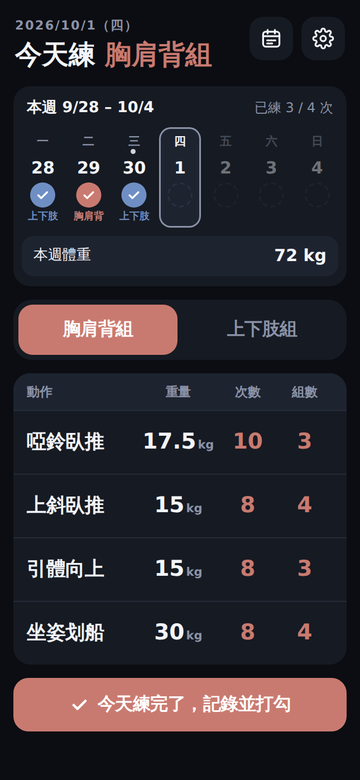
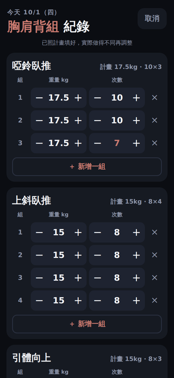
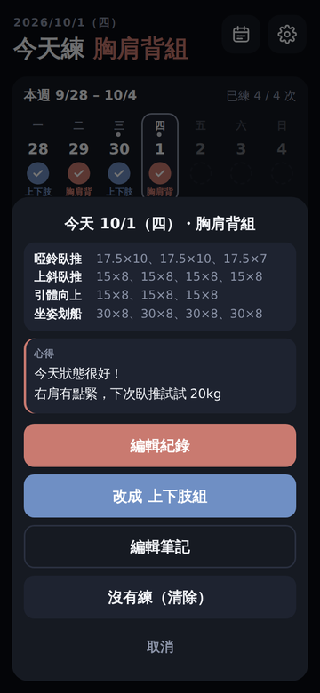
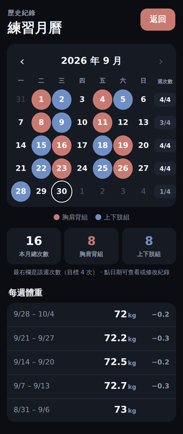

# 健身菜單（雙分化雙循環）

一個給 iPhone 用的健身菜單網頁：打開就知道今天要練哪些動作、用多重、做幾下幾組，練完可以記錄實際做了多少、寫下心得，也能回頭看過去幾週的訓練次數、筆記和體重變化。

## 🌐 [點這裡直接開啟網頁版](https://TYwry.github.io/workout-menu/)

不用下載、不用安裝。用 iPhone 的 Safari 開啟上面的連結，再點「分享」→「加入主畫面」，就能像 App 一樣從主畫面打開。

---

## 畫面預覽

| 主畫面 | 記錄實際訓練 | 每週練滿 4 次 |
|:---:|:---:|:---:|
|  |  |  |

| 查看某天的紀錄與心得 | 歷史紀錄 |
|:---:|:---:|
|  |  |

## 這個網頁能做什麼

- **今天練什麼一目了然**：分成「胸肩背組」和「上下肢組」兩組，點上方按鈕切換。下方表格列出每個動作的重量、次數、組數。
- **本週打勾**：畫面上方顯示這週一到週日，練過的日子會打勾並標出練了哪一組，右上角顯示「已練 幾 / 4 次」。
- **記錄實際做了多少**：練完按「今天練完了，記錄並打勾」，每一組的重量和次數都已照計畫填好；哪一組少做或多做，用 − ＋ 改掉就好（例如第 3 組只做了 7 下）。也可以多加一組、刪掉一組，或把沒做的動作整個刪掉。
- **心得與筆記**：練完時可以在紀錄頁最下面寫「今日心得」；沒練的日子也能點那天寫筆記（例如「休息日，腿還有點痠」）。有筆記的日子在日期上會有一個小點，點進去就能讀到完整內容。
- **每週練滿 4 次的鼓勵**：這週存下第 4 次紀錄時，會有一隻可愛的機器人跳出來跳舞為你加油，按「繼續」關閉。每週只會出現一次。
- **每週體重**：每週第一次練完時會提醒你量體重；也可以隨時點「本週體重」輸入或修改。
- **歷史紀錄**：用月曆看每天練了哪一組、哪幾天有筆記、每週練了幾次、每個月的總次數，以及每週的體重和跟前一週的差距。點月曆上的任一天，可以查看、補登或修改那天的紀錄和筆記。
- **調整計畫**：點右上角齒輪，可以改每個動作的預定重量、次數、組數。

## 使用前需要準備什麼

- 一支 iPhone，使用內建的 **Safari** 瀏覽器（其他手機或電腦的瀏覽器也能開，但畫面是照 iPhone 設計的）。
- 需要網路才能第一次打開網頁；加到主畫面後，平常使用幾乎不需要網路。
- 不用註冊帳號，也不用安裝任何東西。

## 怎麼開始使用

1. 在 iPhone 上用 Safari 點開本頁最上方的「點這裡直接開啟網頁版」。
2. 點畫面下方的「分享」按鈕（方框加向上箭頭的圖示）。
3. 往下找到「加入主畫面」，點「新增」。
4. 之後從主畫面的「健身菜單」圖示打開即可。
5. 第一次使用時，建議先點右上角 **齒輪**，把每個動作的重量、次數、組數改成你自己的計畫，改完按「完成」。

### 每次練完之後

1. 在主畫面點上方的「胸肩背組」或「上下肢組」，選今天練的那一組。
2. 練完按最下面的「今天練完了，記錄並打勾」。
3. 在紀錄頁把實際做的重量、次數改好（跟計畫一樣就不用改）；想記下感受的話，在最下面的「今日心得」寫幾句（可以不寫）。
4. 按「儲存並打勾」。
5. 如果是這週第一次練，會跳出體重輸入框，輸入體重（例如 70.5）後按「儲存」；不想記可以按「稍後再說」。
6. 如果是這週第 4 次，機器人會跳出來鼓勵你，按「繼續」即可。

### 沒練的日子想寫筆記

點本週日期（或歷史紀錄月曆）上的那一天 →「寫筆記」→ 寫完按「儲存」。要修改時點「編輯筆記」；把內容清空或按「刪除這則筆記」就會刪除。

### 各個按鈕在哪裡

| 位置 | 功能 |
|---|---|
| 右上角 月曆圖示 | 歷史紀錄（練習月曆、每週體重） |
| 右上角 齒輪圖示 | 調整計畫的重量、次數、組數 |
| 本週日期的任一天 | 查看、補登、修改或清除那天的紀錄，寫或讀那天的筆記 |
| 「本週體重」那一格 | 輸入或修改這週的體重 |

## 檔案說明

一般使用者**不需要下載任何檔案**，直接用上面的網頁版即可。以下是給想自己架設或修改的人參考：

| 檔案 | 用途 |
|---|---|
| `index.html` | 網頁本體，所有功能都在這個檔案裡。用瀏覽器直接打開就能使用。 |
| `apple-touch-icon.png` | 加到 iPhone 主畫面時顯示的圖示。 |
| `screenshots/` | 本說明頁使用的畫面截圖。 |
| `setup-github.bat` | （Windows）第一次把專案上傳到 GitHub 並開啟網頁版時使用，只需要執行一次。 |
| `save.bat` | （Windows）修改檔案後，雙擊就會把新版上傳到 GitHub，網頁版約 1 分鐘後更新。 |

## 常見問題

**Q：換了手機，或清除 Safari 的網站資料後，紀錄不見了？**
所有資料只存在這支手機的 Safari 裡，沒有備份到網路上，所以換手機或清除網站資料後會回到預設值。

**Q：隔了一陣子沒打開，資料不見了？**
請從「主畫面圖示」打開。如果只是用 Safari 分頁開啟，且超過 7 天沒有使用，Safari 可能會自動清掉網站資料。

**Q：頁面最下面出現「此瀏覽器無法儲存資料」？**
代表瀏覽器不允許這個網頁存資料（例如使用「私密瀏覽」）。請改用一般模式的 Safari 開啟。

**Q：按「沒有練（清除）」會把筆記也刪掉嗎？**
不會。清除只會拿掉那天的打勾和組數紀錄，筆記會保留；要刪筆記請用「編輯筆記」→「刪除這則筆記」。

**Q：動作的名稱可以改嗎？**
目前動作名稱是固定的，只能調整重量、次數、組數。

## 注意事項

- **資料只存在你的手機上**：訓練紀錄、筆記、體重都存在手機的瀏覽器裡，不會傳到任何伺服器，網頁本身也不會連線到其他網站。
- **自動清除舊資料**：打勾紀錄、詳細紀錄、筆記和體重會保留約 2 年，更舊的會自動刪除。
- **網頁內容是公開的**：網頁版放在公開的 GitHub Pages 上，任何人都能打開這個網址看到預設的菜單；但每個人的紀錄都只存在自己的手機裡，別人看不到。
